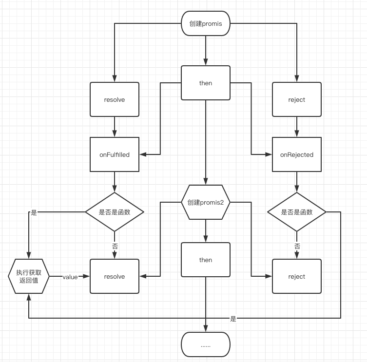
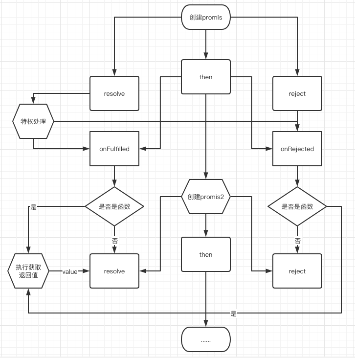

# Promises/A+  学习（面对小白的最佳教程）

[Promises/A+中文翻译](https://juejin.cn/post/6844903919261351949) | [Promises/A+](https://promisesaplus.com/) | [github](https://github.com/promises-aplus) | [本文原码地址](https://github.com/sx6316/learn-promises)

## 前言

首先介绍下这个文章，它只是实现了最简单的 Promises/A+ 规范，到底里面有什么bug什么的我也不知道（我是小白），但是100%通过官方提供的单测，至于其他的不重要，面向测试开发。

Promises重要性什么的就不说了，但是如果是初学者不要为了去实现而去实现，认为实现了就可以加深对于 Promises的理解的话，我个人觉得你可以跳过，没必要看这篇烂文章。小白就是小白就算把火箭造出来了也只是copy而已，没有用的我试过了。去实现Promises/A+ 规范适合什么人，什么人才有比较好的收益呢？这个是没有标准的，相对来说更适合那些基础好，逻辑好，或者天赋选手以及一些有一定经验积累的小白。

收获，会有什么收获，这不会让你更了解Promise，因为你本来就会用，但是会对已会的知识进行梳理，让本来每秒运行一个周天的你可以上升一个层次，运行快那么一点点

## 前置 - 天选小白筛选测试题

#### 问题一 你是小白吗？

找个没人的地方 读**三**遍 “**我是小白 我是小白 我是小白**"

#### 问题二 什么是状态？什么是锁和闩？

#### 问题三 回调函数长什么样？有什么用？可以不用吗？

#### 问题四 什么是发布订阅？为什么需要这种模式？

### 答案

这些问题我都不会，我只会问题一的 因为是我写的，其他的我可以写写我的看法，不对可以纠正

#### 问题一

如果读得特别大声 或者 很顺 很流畅 那你是小白 不是天选小白 可以直接跳过了；如果不读或者小声读了，反正就是内心感觉很平静，那么欢迎大佬前来指教；如果感觉不咋滴，不知道怎么表达，或者有其他各种心情，那恭喜你，你就是天选小白，绝对会有收益，至于多少就不知道了

#### 问题二

**状态**是可以理解是一个变量，但是变量都是状态吗，这就是在用途上区分了，首先 打开百度或者谷歌 输入 状态，就可以看到

***百度百度科***

> 状态是汉语词语，拼音是zhuàng tài，意思是多指状貌特征与动作情态。在学术领域是指对象涉及的过程，由一组物理量来表征。例如质点的机械运动状态由质点的位置和动量来确定；由一定质量的气体组成的系统的热学状态可由系统的温度、压强和体积来描述。该词亦指各种物态，例如物质的固态、液态和气态等。

也就是有那么几种特定的值的变量，写个百度治病的例子

```javascript
function canDie(q='') {
  switch (q) {
    case '头痛':
      return '血管硬化'
    case '肚子痛':
      return '肠胃癌'
    default:
      return q.replace(/(不舒服|痛|晕|麻)/,'癌')
  }
}
```

或者是可能存在某种联系和转换，写个治病的

```javascript
const YOU = '正常'
YOU = '头痛'
YOU = canDie(YOU)
YOU = noDie(YOU) ? '正常' : '生无可恋'
function noDie(s) {
  switch (q) {
    case '头痛':
      return '多喝热水'
    case '肚子痛':
      return '多喝热水'
    default:
      return '多喝热水'
  }
}
```

**锁和闩**，其实闩就是锁的一种了，就是一根在屋内卡着门的板，说到锁其实大家都能很快想到这样的代码

```javascript
let loading = false
async function getList(params) {
  if(loading) return
  loading = true
  await fetch(xxx)
  loading = false
}
```

我们在获取数据时经常会做的操作，这就是上锁，其实扣字眼用 闩 是更准确的，就和我们上厕所要闩住门出去要解开一样，当然你要是一个人住或者对同室早有预谋那无所谓了，也就是说实际上**我们真的完全可控下这种操作是可以忽略的**。

#### 问题三

一个函数作为有效参数传入另一个函数，这个函数就是回调函数

```javascript
function getData(fn) {
  const a = 1
  const b = 2
  fn(a + b)
}
getData((c)=>{console.log(c)})
```

就是这个样，fn就是那个叫回调函数的，其他都不用管，只要知道长这样就成，毕竟回调函数和普通函数没有区别就是用法上的形式区别。除了大家常见的异步情况需要用到回调函数，处理无法确定完成的预期外，其实还有个作用就是解耦，让耦合度降低，给外部开放一些自定义功能，开发更灵活，很常见，比如数组对象提供的遍历api `forEach`、 `map`、 `filter` 等。根据情况，大部分回调都是无法避免的，提个醒 `Promise `是回调，就连 `async await`也是，只是写的格式让你感觉不是。

#### 问题四

早期设计模式中没有发布订阅模式，是不是很惊喜很意外，只有观察者模式，其实也没什么区别就是说法不一样。发布订阅模式其实没什么好说的，这种场景很常见，比如点头像的加号，以后我发文章你就可以收到通知了；我们需要实现什么呢？其实只需要实现类似知乎这个提供订阅方式（点头像+关注），提供发布方式的系统（作者发布->订阅者消息提醒和文章推送），什么订阅者、发布者的都不用管，所以怎么写呢？我去网上抄一段先。

```javascript
class Event {
  constructor() {
    // 储存事件的数据结构
    // 为查找迅速， 使用对象（字典）
    this._cache = {}
  }
  // 绑定
  on(type, callback) {
    // 为了按类查找方便和节省空间
    // 将同一类型事件放到一个数组中
    // 这里的数组是队列， 遵循先进先出
    // 即新绑定的事件先触发
    let fns = (this._cache[type] = this._cache[type] || [])
    if (fns.indexOf(callback) === -1) {
      fns.push(callback)
    }
    return this
  }
  // 触发
  // emit
  trigger(type, data) {
    let fns = this._cache[type]
    if (Array.isArray(fns)) {
      fns.forEach((fn) => {
        fn(data)
      })
    }
    return this
  }
  // 解绑
  off(type, callback) {
    let fns = this._cache[type]
    if (Array.isArray(fns)) {
      if (callback) {
        let index = fns.indexOf(callback)
        if (index !== -1) {
          fns.splice(index, 1)
        }
      } else {
        // 全部清空
        fns.length = 0
      }
    }
    return this
  }
}
```

[代码来源 @白鲸鱼](https://zhuanlan.zhihu.com/p/60324936)，代码都看得懂吧，我就不解说了，看了下这原文回复说有bug，不会吧，抄的代码还有bug，谁知道哪有bug@我。

为什么要用这种模式？主要是 疏通数据链路，宽松耦合，多方位任意通信，降低上下游心智负担，提高研发效率，减少维护成本，创造 高能效，低消耗 大数据通信生态。都懂吗？不懂的v我50，我给全面培训包学包会。

## `Promise`主体实现

好了，能看到这里的就只有这文章的目标人群了，下面是正文，看正文一定要记得前置知识怎么套进去，哪里是哪里。

[Promises/A+中文翻译](https://juejin.cn/post/6844903919261351949)| [Promises/A+ 原文](https://promisesaplus.com/) ，先将规范文档复制过来，大家根据自己英语水平点开来看吧，我就看中文的吧，个人建议是最好能点开好好读一遍。

### 1.术语 可以直接跳过，直接 2.1 看起

> Promise必须处于以下三种状态之一： pending, fulfilled 或 rejected。
> * 2.1.1. pending状态时，Promise：
>   * 2.1.1.1. 可以过渡到fulfilled或rejected的状态。
> * 2.1.2. fulfilled状态时，Promise：
>   * 2.1.2.1. 不得过渡到任何其状态。
>   * 2.1.2.2. 必须有一个值(value)，绝不能改变。
> * 2.1.3. rejected状态时，Promise：
>   * 2.1.3.1. 不得过渡到任何其状态。
>   * 2.1.3.2. 必须有一个原因(reason)，绝不能改变。

这里很简单讲 Promise 的三个状态关系，就是Promise有一个状态，初始为padding，只有 padding可以转换状态，转换后fulfilled 有个 value值，rejected 的是reason ，也就是面试八股最喜欢问的东西。如果想看完整源码直接看最后部分，下面实现方式是函数生成Thenable，会和常用的Promise有一定的出入，我们只需要定一个变量放状态，一个变量放value或者reason就好，这里不管是谁写都是这样的，最多就是变量名不一样，或许他保存状态的变量叫 status 。[关于state和status](https://www.zhihu.com/question/21994784)。

```javascript
const STATES = {
  PADDING: "PADDING",
  FULFILLED: "FULFILLED",
  REJECTED: "REJECTED",
};

function CreateThenable() {
  let state = STATES.PADDING
  let result = null

  // 转换状态
  function transformState(theState, v) {
    if (state === STATES.PADDING) {
      state = theState;
      result = v;
    }
  }
}

```

### 2.2.`then`方法

这时可以先不去看规范，then是什么，主要是干嘛的？看过规范的我先介绍下规范定义了什么，很多人都以为规范定义了Promise 但是，它其实定义的是 如何承接上下两个 Promise，它没有定义怎么去声明一个 promise ，回到问题then是什么角色，看下面定义，有一半答案。

> promise必须提供一种 `then`方法来访问其当前或最终的value或reason。
> promise的 `then`方法接受两个参数：
>
> ```javascript
> promise.then(onFulfilled, onRejected)
> ```

这话就是说我传两回调函数进去，你去调用给我回传 value 或 reason。至于什么时候调用，怎么调用，不知道，没有定义。所以我们得提供一个让它可以去触发这两个回调函数的方法，这是神马，不就是发布订阅吗？弄个触发函数和then（订阅函数），代码就多了一个触发函数 和 then以及装订阅回调函数的数组

```javascript
function CreateThenable() {
  let state = STATES.PADDING
  let result = null
  let callbacks = []
  const Thenable = { emit, then }
  // ...

  function emit(type, value) {
    for (const item of callbacks) {
      const { onFulfilled, onRejected } = item;
      if (type === 'resolve') {
        onFulfilled(value)
      } else {
        onRejected(value)
      }
    }
  }

  function then(onFulfilled, onRejected) {
    callbacks.push({
      onFulfilled, onRejected
    })
  }
  return Thenable
}
```

回去对比下上面发布订阅的代码，是不是很像，这其实现在已经实现Promise 的基底，用下有点那味

```javascript
const mp = CreateThenable()
mp.then((v)=>{console.log(v)})
mp.emit('resolve',123)
```

你说根本就不像那我们改下

```javascript
function CreateThenable() {
  let state = STATES.PADDING
  let result = null
  let callbacks = []
  const Thenable = { resolve, reject, then }
  // ...
  function resolve(value) {
    emit("resolve", value);
  }
  function reject(value) {
    emit("reject", value);
  }
  return Thenable
}
```

用起来和对比下

```javascript
const mp = CreateThenable()
setTimeout(() => {
  mp.resolve(123)
}, 0);
mp.then((v) => { console.log(v); })

const p = Promise((resolve) => {
  setTimeout(() => {
    resolve(123)
  }, 0);
})
p.then((v) => { console.log(v); })
```

没什么区别吧，只是它让传个函数进去然后让它**立即执行**给你**回传触发函数**，我们就省去这些绕来绕去的，在外面执行。

> * 2.2.2 If `onFulfilled` is a function:
> * 2.2.2.1 it must be called after `promise` is fulfilled, with `promise`’s value as its first argument.

下面的2.2.2和2.2.3都是是关于关联状态的，不用中文是中文它将 `fulfilled` 这个状态值给翻译了，这不应该翻译，而是作为状态提示会更好。现在流程就是  **调用 `emit` (触发) => `transformState` (改变状态) => `handleCallBacks`(执行回调-通知)**

```javascript
function CreateThenable() {
  let state = STATES.PADDING
  let result = null
  let callbacks = []
  const Thenable = { resolve, reject, then }
  // ...
  function emit(type, value) {
    if (type === 'resolve') {
      return transformState(STATES.FULFILLED, value)
    }
    transformState(STATES.REJECTED, value)
  }

  function transformState(theState, v) {
    if (state === STATES.PADDING) {
      state = theState;
      result = v;
      handleCallbacks()
    }
  }

  function handleCallbacks() {
    for (const item of callbacks) {
      const { onFulfilled, onRejected } = item;
      if (state === STATES.FULFILLED) {
        typeof onFulfilled === 'function' && onFulfilled(result)
      } else {
        typeof onRejected === 'function' && onRejected(result)
      }
    }
  }
  return Thenable
}
```

这一段其实就是将两种情况和两个状态关联起来，执行对应的回调，**相当于两个相对独立的发布订阅，只是共用了初始的状态**。then作用的另一半用处是 2.2.7，**就是实现链式调用**。

> * 2.2.7 `then`必须返回一个 `promise `3.3。
> * 2.2.7.1.如果任一 `onFulfilled`或 `onRejected`返回一个值 `x`(`x`可能是 `promise`,所以需要增加处理函数)，运行 `Promise`解决程序 `[[Resolve]](promise2, x)`。
> * 2.2.7.3.如果 `onFulfilled`不是一个函数并且 `promise1`已经完成，则 `promise2`必须使用与 `promise1`相同的value来fulfilled。

面试题 then 会返回一个 `promise`。对了忘了说了这部分是只走主线，以主体实现为主，重点是理解，没讲的是些细节考虑后面会重新梳理。这里是返回 `promise` 大家都知道，**而2.2.7.1和2.2.7.3是规定了上下两个 `promise` 的交接。** 搞懂这里就是先回到发布订阅流程来：**发布触发 => 执行订阅的回调**。我们现在有两个连着的就是： **发布触发 => 执行订阅的回调 并且 触发 `promise2`的发布 => 执行订阅 `promise2`的回调 。** 就是定义了**怎么去执行 `promise1` 的 回调 和怎么触发 `promise2`**，毕竟我们一个 `promise`就是两发布订阅 `resolve` => `onFulfilled` 和 `reject` => `onRejected`，两 `promise`个就是四个了

2.2.2说 `onFulfilled`或 `onRejected` 回调是个函数，你就用就行，2.2.7.1 其实就是补充了下说函数用了可能有返回值你得处理，就给promise2的 `resolve` 触发当value吧；2.2.7.3也是补充，说这个东西要是不是函数怎么办，promise1不就白打工了吗，不行你得沿用 promise1 的触发情况来触发 `promise2`。

```javascript
const STATES = {
  PADDING: "PADDING",
  FULFILLED: "FULFILLED",
  REJECTED: "REJECTED",
};

function CreateThenable() {
  let state = STATES.PADDING
  let result = null
  let callbacks = []
  const Thenable = { resolve, reject, then }
  function resolve(value) {
    emit("resolve", value);
  }
  function reject(value) {
    emit("reject", value);
  }
  function emit(type, value) {
    if (type === 'resolve') {
      return transformState(STATES.FULFILLED, value)
    }
    transformState(STATES.REJECTED, value)
  }
  function then(onFulfilled, onRejected) {
    // 创建下一个Promise
    const nextPromise = CreateThenable()
    // 把新的promise也存进去，要和处理回调时一起触发呢
    callbacks.push({
      onFulfilled,
      onRejected,
      np: nextPromise,
    })
    return nextPromise
  }
  function transformState(theState, v) {
    if (state === STATES.PADDING) {
      state = theState;
      result = v;
      handleCallbacks()
    }
  }
  function handleCallbacks() {
    for (const item of callbacks) {
      const { np, onFulfilled, onRejected } = item;
      if (state === STATES.FULFILLED) {
        // 执行对应的 np.resolve, onFulfilled 
        handleCallback(np, np.resolve, onFulfilled)
      } else {
        // np.reject, onRejected
        handleCallback(np, np.reject, onRejected)
      }
    }
  }
  function handleCallback(np, emit, callback) {
    if (typeof callback !== 'function') return emit(result)
    const x = callback(result)
    np.resolve(x)
  }
  return Thenable
}
```

其实到这一步就将 `promise` 流程跑完了，其他是漏洞填补和特权处理，可以看下流程图对比下上面内容，**中间是创建promise或者then收集回调函数，两边才是运行路线。**



promise 的主要流程是操作和对接，不要去看 state 这个状态，这个状态其实是辅助实现这些操作的，不考虑同步和回调约定异步的情况，我都不需要state这个东西，它基本都是一条线路的，流程很直白 就是 `resolve` 触发就是执行 `onFulfilled` ，我是说现在的流程图，完整规范 resolve 比较高级，它要给特权，我想不到什么词去形容，特权是比较符合的，他可以额外处理promise作为输入值，让异步对接更流畅。



### 2.3 \[Resolve\]\(promise, x\)，resolve操作的特权功能

> * 2.3.1.如果 `promise`和 `x`引用同一个对象，请以 `promise TypeError`为reason来rejected。
> * 2.3.2. 如果 `x`是 `promise`，采用其状态
>   * 2.3.2.1. 如果 `x`待处理pending，则 `promise`必须保持待处理状态，直到 `x`fulfilled或rejected为止。
>   * 2.3.2.2. 如果/当 `x` fulfilled，则 `promise`使用相同的value fulfilled。
>   * 2.3.2.3. 如果/当 `x` rejected，请 `promise`以同样的reason rejected。
> * 2.3.3.否则，如果 `x`是对象或函数
> * 2.3.4. 如果 `x`不是一个对象或函数，将 `x`作为 `promise`的fulfilled的value。

**看前面三条都是针对 resolve 的输入值可能为 promise的情况假设**。第四条就是不需要做特权处理的情况，我们现在的情况是不管它输入什么值都直接走fulfilled，描述很直白可以直接转换代码，不过2.3.2 在只有我们实现的环境我们很去判断哪些是promise，所以在实例对象里加个name指向构造函数来判断，实际上这一条只是优化，将这条删了都是可以跑全单测的，应该说这是常规状态，通常用也是用同一个构造函数构造的promise，而2.3.3是兜底兼容其他人实现的promise。

```javascript
const Thenable = { resolve, reject, then, name: CreateThenable }
// ...
function emit(type, value) {
  if (type === 'resolve') {
    // resolve触发接入特权处理，不能直接改变状态，改变了就只能调对应状态的回调了
    return handleResolvePromise(value)
  }
  transformState(STATES.REJECTED, value)
}

function handleResolvePromise(x) {
  // 套一层，有需要当回调传过去情况
  const resolve = function (value) { transformState(STATES.FULFILLED, value) };
  const reject = function (value) { transformState(STATES.REJECTED, value) };

  if (Thenable === x) return reject(new TypeError("2.3.1"));
  if (x && x.name === CreateThenable) {
    // 把触发器当做回调传过去，它触发就触发我们了
    return x.then(resolve, reject); 
  }
  if (x !== null && (typeof x === "object" || typeof x === "function")) {}
  resolve(x);
}
```

> * 2.3.3.1.让 `then = x.then`。
> * 2.3.3.2.如果检索属性 `x.then`中抛出的异常的结果 `e`，将 `e`作为 `promise`的reason来rejected。
> * 2.3.3.3.如果 `then`是函数，将 `x`作为 `this`调用它，第一个参数 `resolvePromise`和第二个参数 `rejectPromise`，其中：
>   * 2.3.3.3.1. 如果 `resolvePromise`被调用并返回一个值 `y`(原理同 `x`，可能为 `promise`)，则运行 `[[Resolve]](promise, y)`。
>   * 2.3.3.3.2. 如果/当 `rejectPromise`被调用并是带一个reason `r`，将 `r`作为拒绝 `promise`的reason。
>   * 2.3.3.3.3. 如果这两个 `resolvePromise` 和 `rejectPromise`被调用，或多次调用相同的参数，则第一次调用优先，任何进一步的调用将被忽略。
>   * 2.3.3.3.4.如果调用 `then`抛出异常 `e`:
>     * 2.3.3.3.4.1. 如果 `resolvePromise`或 `rejectPromise`已被调用，请忽略它。
>     * 2.3.3.3.4.2. 否则，将 `e`作为 `promise`的rejected的reason。
> * 2.3.3.4.如果 `then`不是一个函数，将 `x`作为 `promise`fulfilled的value。

**忘说了 `resolvePromise` 和 `rejectPromise` 其实是触发函数，就是 发布订阅模式的触发函数，`reject `的触发是直接改变状态，而`resolve` 经过特权处理才决定改变状态，提个醒我们这个函数内的 `reject` ，resolve函数都是直接改变状态**，先上代码吧。

```javascript
function handleResolvePromise(x) {
  // 套一层，有需要当回调传过去情况
  const resolve = function (value) { transformState(STATES.FULFILLED, value) };
  const reject = function (value) { transformState(STATES.REJECTED, value) };
  if (Thenable === x) return reject(new TypeError("2.3.1"));
  if (x && x.name === CreateThenable) {
    // 把触发器当做回调传过去，它触发就触发我们了
    return x.then(resolve, reject);
  }
  if (x !== null && (typeof x === "object" || typeof x === "function")) {
    let then;
    try {
      then = x.then;
    } catch (e) {
      reject(e);
    }
    if (typeof then === "function") {
      let runOne = false;
      const run = (cb) => (v) => {
        if (runOne) return;
        runOne = true;
        cb(v);
      };
      try {
        then.call(x, run(handleResolvePromise), run(reject));
      } catch (e) {
        run(reject)(e);
      }
      return;
    }
  }
  // 2.3.4 和 2.3.3.4
  resolve(x);
}
```

1 2 4都很直白，照着文字无脑转换就行，而2.3.3.3 只需要搞清楚触发函数就成：resolvePromise路线函数不能直接改变状态所以就是handleResolvePromise自调用处理特权问题处理 y ，而 `rejectPromise`reject可以直接改状态就是reject ，还要注意 2.3.3.3.3 和2.3.3.3.3 确保handleResolvePromise 和 reject 在处理时保证线路一致问题，要求一共只能触发一次，所以我们加个锁，防止多次触发，导致线不一致，比如 执行 then 最后代码报错了，但是已经调用我们的 handleResolvePromise了，刚好获取到的y是个promise而且是异步的，看下面例子。

```javascript
const mp = CreateThenable()
mp.then((v) => { console.log(v) }, (e) => { console.log(e) })
mp.resolve({
  then(onFulfilled) {
    onFulfilled({
      then(onFulfilled) {
        setTimeout(() => {
          onFulfilled("fulfilled");
        }, 0);
      },
    });
    throw { error: "error" };
  },
})
```

比如这个例子预期应该是fulfilled，如果不做锁处理就出现了异常 `e` 抢了明明调用了resolve的路线，导至resolve值无法更新过去了，不符合2.3.3.3.4；同理，这个测试将抛出异常改成 reject调用就 是不符合 2.3.3.3.3了，到这一步已经是将promise主体跑完了，可以复制组装下代码试试，我就不粘了，发现什么问题先放下，看下一节。

## 查补和思考

### 异步和同步问题

我们new 一个promise通常是传一个函数过去，然后获取到 resolve和reject的触发器，而这个函数是立即执行的，如果我们同步就去用触发器呢，就会出现先发布后订阅的情况。

```javascript
const p = new Promise((res)=>{res(1)})
p.then((v)=>{console.log(v)})

const mp = CreateThenable()
mp.resolve(1)
mp.then((v)=>{console.log(v)})
```

这种情况怎么办，有些头脑灵活的同学就会想到用setTimeout，比如像下面这样在触发器

```javascript
function resolve(value) {
  setTimeout(() => {
    emit("resolve", value);
  }, 10);
}
```

但是呢，好像忘了别人用then方法时也可以用setTimeout套着用的

```javascript
const mp = CreateThenable()
mp.resolve(1)
setTimeout(() => {
  mp.then((v)=>{console.log(v)})
}, 100);
```

这方法肯定是不行的，总不能和使用者比谁的定时长吧，其实这问题并不复杂，还是用我举例子吧，你们关注我了，但是这是在文章发出后的，这时平台很聪明在你们关注我时就立即将我在你关注前的文章都推给你了，这里也是这样，在then执行时我们就将回调给执行就好，但是呢我们这用两个发布订阅所以得引入一个状态去记录我们当时执行的是 resolve还是reject，就是大家喜欢背的3个状态，没多大意义。状态我们记录了，所以只需要判断下状态就好

```javascript
function then(onFulfilled, onRejected) {
  // 创建下一个Promise
  const nextPromise = CreateThenable()
  // 把新的promise也存进去，要和处理回调时一
  callbacks.push({
    onFulfilled,
    onRejected,
    np: nextPromise,
  })

  //不是padding说明触发器被同步触发，应该说在订阅前就触发了
  if (state !== "PADDING") {
    handleCallbacks();
  }
  return nextPromise
}
```

同异步问题还有一点就是 2.2.4 和 3.1，实现它已经说出来了，**明确就是在执行回调时得异步，这应该是为了保证then代码一个异步执行原则，不管是否是异步触发，这样就能更好预测回调行为，避免同步触发和异步触发then的调用时机不一致**。

> * 2.2.4. `onFulfilled`或者 `onRejected`在执行上下文堆栈仅包含平台代码之前不得调用。(链式调用，then方法返回一个新的promise对象，需要等新promise对象实例化结束后才能调用then的回调函数)3.1。
> * 3.1. 这里的“平台代码”意味着引擎，环境和promise实现代码。在实践中，此要求确保在调用事件循环并且使用新堆栈之后异步执行 `onFulfilled`和 `onRejected`执行 `then`。这可以用“宏任务”机制实现，例如 `setTimeout`或者 `setImmediate`，或者用“微任务”机制，例如 `MutationObserver`或 `process.nextTick`。由于 `promise`实现被认为是平台代码，因此它本身可能包含一个任务调度队列或“trampoline”，其中调用处理程序。

可以用`queueMicrotask`（微任务）`setTimeout`都行，看情况，兼容 `setTimeout`会更好

```javascript
function handleCallback(np, emit, callback) {
  queueMicrotask(() => {
    if (typeof callback !== 'function') return emit(result)
    const x = callback(result)
    np.resolve(x)
  })
}
```

### 代码安全问题（信任问题）

什么代码是可信的，什么是不可信的？对于交际来说，任何一切外部的东西都是不可信的，代码也一样，执行外部代码输入的代码有两个地方，一是回调函数。

> * 2.2.7.2.如果 `onFulfilled`或者 `onRejected`抛出异常 `e`，将 `e`作为 `promise2`rejected的reason。

```javascript
function handleCallback(np, emit, callback) {
  queueMicrotask(() => {
    if (typeof callback !== 'function') return emit(result)
    try {
      const x = callback(result)
      np.resolve(x)
    } catch (e) {
      np.reject(e)
    }
  })
}
```

二是 特权处理中 处理 thenable。

> * 2.3.3.1.让 `then = x.then`
> * 3.5. 此过程首先存储引用 `x.then`，然后测试该引用，然后调用该引用，避免多次访问该 `x.then`属性。这些预防措施对于确保访问者属性的一致性非常重要，访问者属性的值可能会在检索之间发生变化。

取值，在一个对象中取值也是一个危险的操作，我们只做一次取值保证取值安全以及值的一致性，我相信很多人有看过 "a == 1 & a == 2" 这类问题，而对象属性的话，我们只需要自定义下 getter 就可以达到取值前后不一值，除了这之外还有就是时间差值被改了，就像下面这个值就很危险

```javascript
const a = {
 get then() {
   if (Math.random() > 0.5) throw 'reject'
   return 'fulfilled'
 }
}
```

> 2.3.3.3.4.如果调用 `then`抛出异常 `e`

常规的错误处理，不过需要分错误捕获是触发器触发前还是后，后于触发器触发就忽略掉，是将错误做为备选值，前面有讲过就不细说了。

### 使用问题

> * 2.2.3.3. 它不能被多次调用
> * 2.2.6. `then` 可以在同一个 `promise`上多次调用。

回调函数是我们执行的，我们不能重复去执行，而同一个then是可以多次调用的，也就是可以添加多个订阅回调函数。所以我们需要用数组去存着，而出现同步触发时，我们也存在数组上去了，所以每个then就运行了一次handleCallbacks，会出现重复调用；或者异步触发时，有在触发前后都有订阅，也会出现重复调用问题

```javascript
const mp = CreateThenable()
mp.then(...)
mp.resolve()
mp.then(..)
```

处理起来方法很多，我这里就执行过就清掉。

```javascript
function handleCallbacks() {
  const temp = callbacks;
  callbacks = [];
  for (const item of temp) {
  // ....
  }
}
```

到这一步代码已经可以跑过全部测试了，粘下完整代码吧，**先别急着看代码，下面还有一个给你们赋能的讨论**

```javascript
const STATES = {
  PADDING: "PADDING",
  FULFILLED: "FULFILLED",
  REJECTED: "REJECTED",
};

function CreateThenable() {
  let state = STATES.PADDING;
  let result = null;
  let callbacks = [];

  const Thenable = { resolve, reject, then, name: CreateThenable };
  function resolve(value) {
    emit("resolve", value);
  }
  function reject(value) {
    emit("reject", value);
  }
  function emit(type, value) {
    if (type === "resolve") {
      // resolve触发接入特权处理，不能直接改变状态，改变了就只能调对应状态的回调了
      return handleResolvePromise(value);
    }
    transformState(STATES.REJECTED, value);
  }

  function handleResolvePromise(x) {
    // 套一层，有需要当回调传过去情况
    const resolve = function (value) {
      transformState(STATES.FULFILLED, value);
    };
    const reject = function (value) {
      transformState(STATES.REJECTED, value);
    };

    if (Thenable === x) return reject(new TypeError("2.3.1"));
    if (x && x.name === CreateThenable) {
      // 把触发器当做回调传过去，它触发就触发我们了
      return x.then(resolve, reject);
    }
    if (x !== null && (typeof x === "object" || typeof x === "function")) {
      let then;
      try {
        then = x.then;
      } catch (e) {
        reject(e);
      }

      if (typeof then === "function") {
        let runOne = false;
        const run = (cb) => (v) => {
          if (runOne) return;
          runOne = true;
          cb(v);
        };

        try {
          then.call(x, run(handleResolvePromise), run(reject));
        } catch (e) {
          run(reject)(e);
        }
        return;
      }
    }
    // 2.3.4 和 2.3.3.4
    resolve(x);
  }

  function then(onFulfilled, onRejected) {
    // 创建下一个Promise
    const nextPromise = CreateThenable();
    // 把新的promise也存进去，要和处理回调时一起触发呢
    callbacks.push({
      onFulfilled,
      onRejected,
      np: nextPromise,
    });

    if (state !== "PADDING") {
      handleCallbacks();
    }
    return nextPromise;
  }
  function transformState(theState, v) {
    if (state === STATES.PADDING) {
      state = theState;
      result = v;
      handleCallbacks();
    }
  }
  function handleCallbacks() {
    const temp = callbacks;
    callbacks = [];
    for (const item of temp) {
      const { np, onFulfilled, onRejected } = item;
      if (state === STATES.FULFILLED) {
        // 执行对应的 np.resolve, onFulfilled
        handleCallback(np, np.resolve, onFulfilled);
      } else {
        // np.reject, onRejected
        handleCallback(np, np.reject, onRejected);
      }
    }
  }

  function handleCallback(np, emit, callback) {
    queueMicrotask(() => {
      if (typeof callback !== "function") return emit(result);
      try {
        const x = callback(result);
        np.resolve(x);
      } catch (e) {
        np.reject(e);
      }
    });
  }

  return Thenable;
}
```

**看回2.3.3.3.3** 这一条大家都还有印象吧，是为了保证调用的一致性，忘了的可以回去看下，或者看下代码。

> * 2.3.3.3.3. 如果这两个 `resolvePromise`和 `rejectPromise`被调用，或多次调用相同的参数，则第一次调用优先，任何进一步的调用将被忽略。

我们上面的限制只是对 传入的以及下一个promise限制了触发器只能触发一次，但是呢？漏了 我们自己暴露的触发器，同样存在 resolve 触发因为异步问题，被后调用的reject给抢了的情况。

```javascript
const mp = CreateThenable()
mp.resolve({
  then(cb) {
    setTimeout(() => {
      cb('resolve')
    }, 0);
  }
})
mp.reject('reject')
mp.then((v) => {
  console.log(v);
}, (e) => {
  console.log(e);
})
```

看这里这里就出现为reject调用是不符合调用原则的，**处理这情况不知道算不算2.3.3.3.3.定义，英语好的可以上[promise-tests](https://github.com/promises-aplus/promises-tests)去提一个 issues 或者 pr**，我个人觉得是算的，只是它测例漏了。es6的promise输出是 resolve 的符合调用原则，避免这种情况，也很好改，我们给上个锁就好，而2.3.3.3，我们可以直接创建一个Promise让它给我们处理就好。

```javascript
let isRun = false;
// ...
function emit(type, value) {
  if (isRun) return;
  isRun = true;
  
  //...
}

function handleResolvePromise(x) {
  //..
  if (x !== null && (typeof x === "object" || typeof x === "function")) {
    let then;
    try {
      then = x.then;
    } catch (e) {
      reject(e);
    }
    if (typeof then === "function") {
      const p = CreateThenable();
      p.then(resolve, reject);
      try {
        then.call(x, p.resolve, p.reject);
      } catch (e) {
        p.reject(e);
      }
      return;
    }
  }
  resolve(x);
}
```

### **thenable问题**

> * 1.2. “thenable”是定义 `then`方法的对象或函数。(promise是thenable对象)

这是术语的介绍，也就是有then方法就算是 thenable了，这就会出现强锁定了 then 这个方法名了，要是你一个对象中不幸出现是叫 then ，而且刚好作为触发值（第一次触发，或者then回调函数return），你的promise可能无法预期执行。

```javascript
const mp = CreateThenable()
mp.resolve({
  val:'我是你的不到的值',
  then() {}
})
mp.then((v) => {
  console.log(v);
})
```

避免方案也还是是有的，可以给then加个标记什么的都行

## 实践和测试

[本文原码地址](https://github.com/sx6316/learn-promises)

说那么多其实都是没有用的，不管看多少文章，只要不动手我敢说没有谁几天后还能记得，这文章重点是最后这一部分，这个源码地址也是我用来学习的，src/base是最开始对着稳定写的，注释了一些节点信息，觉得base里写得不够直观，而src/rew是写这文章重写的，你们要是学时最好创建一个文件来学，用node直接跑，也不要去直接看源码。经过实践最方便的就是像我重写时候一样创建一个js文件，用node直接跑官方提供的单测，出现哪条跑不通自己将对应错误的测例（在node_modules/promises-aplus-tests/lib下）拆出来跑下，我当时也是晕了，还自己用jest。

```shell
npm i
// 测试rew
npm run t_rew
```

我希望的是大家都能自己去尝试，不去试试永远都不会，我本来也不会，试多了就会了，还有就是有什么问题请多联系我，看到必回，共同学习共同进步。
