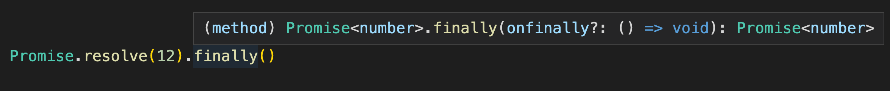

# 对齐es6 Promise api

这里主要是实现es6除了then的其他api，如果需要主体(then)的实现，可以点这里[传送门](./Promise%E5%9F%BA%E6%9C%AC%E5%AE%9E%E7%8E%B0.md)，这些其余的api都是围绕着then去展开的，实现起来都比较简单，这里是非标准实现，没有去扒拉定义，只是对照了下效果。还有一点是这个是使用我自己实现的 Thenable 去实现的。我简单演示下效果
```javascript
const mp = CreateThenable() // 创建 thenable
mp.resolve //调用触发 resolve
mp.reject //调用触发 reject
```

转换为es6 `Promise` 用法是这样的，具体实现还是建议点[传送门](./Promise%E5%9F%BA%E6%9C%AC%E5%AE%9E%E7%8E%B0.md)过去看看 `thenable` 的实现，下面的实现我不会用这个去实现，还是为了方便会用 `CreateThenable` 去创建转接 `thenable` ，自行去替换成下面的P或者Promise。 
```javascript
function P(fn) {
  const mp = CreateThenable();
  try {
    fn(mp.resolve, mp.reject);
  } catch (e) {
    mp.reject(e);
  }

  return mp;
}
```

## 原型链函数 `catch`
这个最简单的，就是不传 `onFulfilled` 回调就成，实现就是这么简单;居于 `Promise` 改是就是加上`this`就好，举例这样，其他api就不列出来了，有什么问题评论区提出来，不保绝对正确
```javascript
function (onRejected) {
  return then(null, onRejected);
}

// Promise
Promise.prototype.catch = function (onRejected) {
  return this.then(null, onRejected);
}
```

## 原型链函数 `finally`
`finally`是在`Promise`完成时调用不管什么状态（`fulfilled | rejected`），我也没怎么用过，我还专门去查了下别人的实现，发现网上的实现和MDN用法以及类型和个人实测有出入（没有找到简短的实现是正确的，**看文章要去辨别**）。其实看下IDE类型提示就可以知道了


和 `then` `catch` 一样传入一个函数进去，也是返回一个 `Promise`，但是很不一样的地方就是这个函数是个无入参且无返回值的函数。无入参也就是无法获取完成后的结果和状态不知道是`fulfilled`还是` rejected`，无返回值就是没办法影响后续返回的`Promise`状态，看图返回是`Promise<number>`这个是继承于第一个`resolve`得来的状态，经过实测传入的函数不管返回什么都不会影响下一个`Promise`的结果和运行，后来又想了下，如果我们传入的函数运行错了呢会怎样？
```javascript
Promise.resolve('resolve').finally(() => {
  throw 'finally'
}).then((d) => {
  console.log(d); // 未调用
}).catch((e) => {
  console.log(e); // finally
})
```
***注意了，会改变返回的`Promise`***，这就很糟糕，使用起来要注意了，不要随意在`finally`后面继续接调用链了

结论就是 **`finally`在`Promise`完成时调用，并且中转上一个Promise（自己当前所在的这个）的状态给自己返回的生成的新的`Promise`，但是调用失败会改变新的`Promise`**

```javascript
function (onFinally) {
  function resolve(result) {
    onFinally(); // 回调错了不用我们管 Thenable自己会捕获
    return result;
  }
  function reject(e) {
    onFinally(); // 回调错了不用我们管 Thenable自己会捕获
    throw e; // 要抛出错误才能被捕获成 reject
  }

  return then(resolve, reject);
}
```
## 静态函数 `resolve`/`reject`
这个比较简单，直接返回`resolve`/`reject`的`Promise`就好。
```javascript
P.resolve = function (PromiseResolveParam) {
  // 自行替换 new Promise 写法，不会请评论区留言，或者私我
  const thenable = CreateThenable(); 

  thenable.resolve(PromiseResolveParam);

  return thenable;
};
```
## 静态函数 `race`
这个也比较简单，创建一个主的 `Thenable` 返回，然后对接迭代对象中的每一个 `Thenable`，然后有可能数组里的可能不是 `Thenable`，我们得创建一层包裹下，让他明确为一个 `Thenable`，对接好后谁先触发自然就调谁了。
```javascript
P.race = function (PromiseRaceParam) {
  const ret = CreateThenable();

  try { // 捕获错误，不是可迭代对象它会报错，不单独去做判断
    for (const thenable of PromiseRaceParam) {
      const handle = CreateThenable();
      handle.resolve(thenable);
      handle.then(ret.resolve, ret.reject);
    }
  } catch (e) {
    ret.reject(e);
  }

  return ret;
};
```

## 静态函数 `all`
`all`和`race`，区别是在`fulfilled`情况，需要等待全部 `fulfilled`；`rejected`处理和`race`一样
```javascript
P.all = function (PromiseAllParam) {
  const ret = CreateThenable();
  const data = []; // fulfilled 结果数组
  let length = 0; // 自己记录传入迭代器的length的长度，不要去读传入迭代器的length可能会出错
  let done = 0;

  function resolve(index) {
    return function (d) {
      data[index] = d;
      done += 1;
      if (done === length) {
        ret.resolve(data);
      }
    };
  }

  try {
    for (const thenable of PromiseAllParam) {
      const index = length; // 返回值有顺序，记录对应顺序
      length += 1;

      const handle = CreateThenable();
      handle.resolve(thenable);
      handle.then(resolve(index), ret.reject);
    }
    if (length === 0) {
      ret.resolve(data);
    }
  } catch (e) {
    ret.reject(e);
  }

  return ret;
};

```

## 静态函数 `allSettled`
和`all`基本一样，它会在`fulfilled`返回`{status，result}`数组，就是全部结果都要处理，入参正确没有`rejected`的情况
```javascript
P.allSettled = function (PromiseAllParam) {
  const ret = CreateThenable();
  const data = [];
  let length = 0;
  let done = 0;

  function handler(index, status) {
    return function (d) {
      // 返回编辑相应的状态
      if (status === STATES.REJECTED) {
        data[index] = {
          status: "rejected",
          reason: d,
        };
      } else {
        data[index] = {
          status: "fulfilled",
          value: d,
        };
      }

      done += 1;
      if (done === length) {
        ret.resolve(data);
      }
    };
  }

  try {
    for (const thenable of PromiseAllParam) {
      const index = length;
      length += 1;

      const handle = CreateThenable();
      handle.resolve(thenable);
      handle.then(
        handler(index, STATES.FULFILLED),
        handler(index, STATES.REJECTED)
      );
    }
    if (length === 0) {
      ret.resolve(data);
    }
  } catch (e) {
    ret.reject(e);
  }

  return ret;
};
```

## 有什么问题可以私聊或评论留言，[源码地址](../src/es6.js)
